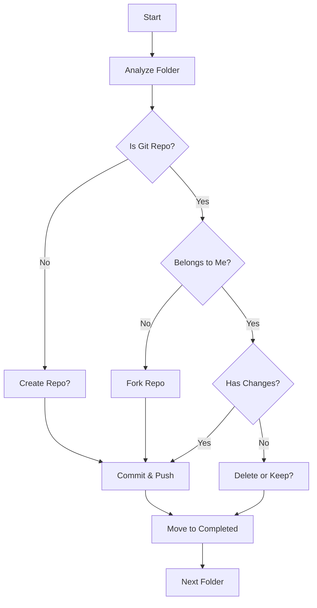

# Mac Cleanup & GitHub Organization Tool

A professional, production-ready suite of tools for cleaning up your Mac development environment and organizing code repositories on GitHub.

## 🎯 Features

- **Automated Repository Organization**: Classify and process repositories automatically
- **Smart Fork Detection**: Identify external repositories and create forks
- **State Management**: Resume interrupted cleanup sessions
- **Sensitive File Handling**: Detect and encrypt sensitive files with GPG
- **Dotfiles Management**: Version control your configuration files
- **Batch Processing**: Process multiple folders efficiently
- **Comprehensive Logging**: Track all operations with detailed logs
- **Dry-Run Mode**: Preview changes before applying them
- **Interactive Prompts**: Make informed decisions during cleanup

## 📋 Prerequisites

### Required

- **Git** - Version control
- **GitHub CLI (gh)** - GitHub operations
- **jq** - JSON processing

### Optional

- **GPG** - For encrypting sensitive files
- **rsync** - Better file copying (included on macOS)

### Installation on macOS

```bash
brew install git gh jq gpg
```

### Installation on Linux

```bash
# Debian/Ubuntu
sudo apt-get install git gh jq gpg

# Fedora/RHEL
sudo dnf install git gh jq gnupg2
```

## 🚀 Quick Start

### 1. Install

```bash
# Clone or download the scripts
cd /path/to/cleanup-scripts

# Run installation
./install.sh
```

### 2. Configure

Edit `~/.cleanup.config` to customize settings:

```bash
# Set your GitHub accounts
DEFAULT_GITHUB_OWNERS="yourusername,yourorg"
MY_GITHUB_ACCOUNTS=("yourusername" "yourorg")

# Set directories
COMPLETED_FOLDER="$HOME/dev_completed"
DOTFILES_REPO="$HOME/dotfiles"
```

### 3. Authenticate with GitHub

```bash
gh auth login
```

### 4. Run Your First Cleanup

```bash
# Dry run first (preview only)
cleanup-manager --dry-run ~/dev

# Run actual cleanup
cleanup-manager ~/dev
```

## 📖 Usage Guide

### Main Cleanup Manager

#### Basic Commands

```bash
# Process a directory
cleanup-manager ~/dev

# Dry run (preview mode)
cleanup-manager --dry-run ~/dev

# Resume previous session
cleanup-manager --resume ~/dev

# Analyze only (no changes)
cleanup-manager --analyze-only ~/dev

# Skip specific folders
cleanup-manager --skip folder1 --skip folder2 ~/dev

# Set default GitHub owner
cleanup-manager --owner BrightSoftwares ~/dev

# Verbose output
cleanup-manager --verbose ~/dev
```

#### Advanced Options

```bash
# Batch processing
cleanup-manager --batch-size 5 ~/dev

# Custom options
cleanup-manager \
  --owner myorg \
  --skip node_modules \
  --verbose \
  ~/dev
```

### Dotfiles Management

#### Initialize Dotfiles Repository

```bash
# Start fresh
version-dotfiles --init

# Will prompt to clone existing or create new
```

#### Add Files/Folders to Dotfiles

```bash
# Add individual file
version-dotfiles --add ~/.bashrc

# Add directory
version-dotfiles --add ~/.config/nvim

# Add with auto-detection
version-dotfiles --add ~/.zshrc
```

#### Sync Changes

```bash
# Commit and push all changes
version-dotfiles --sync
```

#### List Tracked Items

```bash
# See what's being tracked
version-dotfiles --list
```

#### Restore Dotfiles

```bash
# Restore from repository (on new machine)
version-dotfiles --restore
```

#### Untrack Items

```bash
# Stop tracking a file
version-dotfiles --untrack ~/.bashrc
```

## 🏗️ Architecture

### Project Structure

```
cleanup-scripts/
├── cleanup_manager.sh          # Main orchestrator
├── version_dotfiles.sh         # Dotfiles management
├── install.sh                  # Installation script
├── .cleanup.config             # Configuration template
├── lib/
│   ├── core.sh                 # Core utilities & logging
│   ├── state.sh                # State management
│   └── github.sh               # GitHub operations
└── logs/                       # Execution logs
```

### Workflow



## 📊 Repository Categories

The tool automatically categorizes repositories into:

1. **not_a_repo** - Folders that aren't Git repositories
2. **no_remote** - Git repos without a remote configured
3. **external_to_fork** - Repositories from other users
4. **my_repo_with_changes** - Your repos with uncommitted changes
5. **my_repo_clean** - Your repos with no changes

## 🔒 Sensitive File Handling

### Automatically Detected Patterns

The tool detects common sensitive files:

- `.env`, `.env.*`
- `*config.json`, `*config.yaml`
- `*secrets.yml`, `*keys.json`
- `*credentials*`
- `*.pem`, `*.key`, `*.p12`, `*.pfx`

### Encryption Process

1. Files are encrypted with GPG (AES256)
2. Original files are added to `.gitignore`
3. Encrypted versions (`.gpg` extension) are committed

### Usage

```bash
# Set passphrase in config
GPG_PASSPHRASE="your-secure-passphrase"

# Or export as environment variable
export GPG_PASSPHRASE="your-secure-passphrase"

# The tool will prompt if not set
```

## 🔄 State Management & Resume

### How It Works

- Progress is saved after each folder
- State includes: processed folders, categories, status
- Can resume interrupted sessions

### Resume a Session

```bash
cleanup-manager --resume ~/dev
```

### State Files Location

```bash
~/.cleanup_state/
├── state_<hash>.json          # Processing state
├── checkpoint_<hash>.txt      # Last checkpoint
├── categories_<hash>.txt      # Folder categories
└── report_*.txt               # Summary reports
```

## 📝 Configuration Reference

### Key Configuration Options

```bash
# GitHub Settings
DEFAULT_GITHUB_OWNERS="user1,org1,org2"
MY_GITHUB_ACCOUNTS=("user1" "org1")
DEFAULT_OWNER="user1"  # Skip owner selection

# Directories
COMPLETED_FOLDER="$HOME/dev_completed"
BACKUP_DIR="$HOME/.cleanup_backups"
STATE_DIR="$HOME/.cleanup_state"

# Dotfiles
DOTFILES_REPO="$HOME/dotfiles"
DOTFILES_REMOTE="https://github.com/user/dotfiles.git"

# Security
GPG_PASSPHRASE="your-passphrase"  # Not recommended!

# Processing
DRY_RUN=false
VERBOSE=false
BATCH_SIZE=1
AUTO_DETECT_PROJECT_TYPE=true

# Safety
ALWAYS_BACKUP=true
REQUIRE_CONFIRMATION=true
MAX_FOLDERS_PER_SESSION=0  # 0 = unlimited

# Cleanup
TO_DELETE_RETENTION_DAYS=90

# Logging
LOG_LEVEL=1  # 0=DEBUG, 1=INFO, 2=WARN, 3=ERROR
LOG_RETENTION_DAYS=30
```

## 🎯 Use Cases

### Use Case 1: Clean Up Development Folder

```bash
# Preview what will happen
cleanup-manager --dry-run ~/dev

# Process folders interactively
cleanup-manager ~/dev

# After completion, check:
# - ~/dev_completed/ for processed folders
# - ~/.cleanup_state/ for reports
```

### Use Case 2: Fork External Repositories

```bash
# The tool automatically detects external repos
# and prompts to fork them

# Or use the old fork script:
bash fork_existing_repo.sh github-owner ~/dev/repo-name
```

### Use Case 3: Save Uncommitted Changes

```bash
# Automatically detects repos with changes
# Creates migration branch and pushes

# Or process all at once:
cleanup-manager ~/dev
```

### Use Case 4: Set Up Dotfiles

```bash
# Initialize dotfiles repo
version-dotfiles --init

# Add common configs
version-dotfiles --add ~/.bashrc
version-dotfiles --add ~/.config/nvim
version-dotfiles --add ~/.ssh/config

# Sync to GitHub
version-dotfiles --sync

# On new machine:
git clone https://github.com/yourusername/dotfiles
cd dotfiles
version-dotfiles --restore
```

### Use Case 5: Batch Process with Specific Owner

```bash
# Process all folders with specific owner
cleanup-manager --owner BrightSoftwares ~/dev

# Skip folders that are already clean
cleanup-manager --analyze-only ~/dev
# Review categories.txt
# Then process only specific categories
```

## 🛠️ Troubleshooting

### GitHub CLI Not Authenticated

```bash
gh auth login
# Follow the prompts
```

### Permission Denied Errors

```bash
# Make scripts executable
chmod +x cleanup_manager.sh
chmod +x version_dotfiles.sh
chmod +x lib/*.sh
```

### State File Corruption

```bash
# Reset state
rm -rf ~/.cleanup_state/state_*.json
cleanup-manager ~/dev  # Start fresh
```

### GPG Encryption Fails

```bash
# Check GPG installation
gpg --version

# Test encryption
echo "test" | gpg --symmetric --batch --passphrase "test"
```

### Large Files Warning

```bash
# Files > 50MB are flagged
# Consider using Git LFS:
git lfs install
git lfs track "*.zip"
git lfs track "*.tar.gz"
```

## 📊 Reports and Logs

### Generated Reports

After processing, check:

```bash
# Summary report
~/.cleanup_state/report_YYYYMMDD_HHMMSS.txt

# CSV for analysis
~/.cleanup_state/report_YYYYMMDD_HHMMSS.csv

# Execution logs
logs/cleanup_YYYYMMDD_HHMMSS.log
```

### Report Contents

- Total folders processed
- Breakdown by category
- Success/failure counts
- Detailed folder list with status

## 🔐 Security Best Practices

### 1. Never Store Passphrases in Config

```bash
# ❌ Bad
GPG_PASSPHRASE="my-password"

# ✅ Good
export GPG_PASSPHRASE="my-password"  # In secure location
# Or let the script prompt you
```

### 2. Review Before Pushing

```bash
# Always use dry-run first
cleanup-manager --dry-run ~/dev

# Review changes before pushing
git diff
git status
```

### 3. Backup Important Data

```bash
# Backups are automatically created in:
~/.cleanup_backups/
```

### 4. Use SSH Keys for GitHub

```bash
# Generate SSH key
ssh-keygen -t ed25519 -C "your_email@example.com"

# Add to GitHub
cat ~/.ssh/id_ed25519.pub
# Paste in GitHub Settings > SSH Keys
```

## 🚀 Advanced Features

### Parallel Processing

```bash
# Process multiple folders simultaneously
PARALLEL_JOBS=4 cleanup-manager ~/dev
```

### Custom Hooks

Add custom logic in `.cleanup.config`:

```bash
# Run before each folder
PRE_PROCESS_HOOK='echo "Starting: $1"'

# Run after each folder
POST_PROCESS_HOOK='notify-send "Completed: $1"'

# Run on error
ERROR_HOOK='echo "Error: $1" >> errors.log'
```

### Custom Sensitive Patterns

```bash
# In .cleanup.config
SENSITIVE_PATTERNS=(
    ".env"
    "api_keys.txt"
    "*secret*"
    "credentials.yaml"
)
```

### Integration with Organize Tool

```bash
# Use python organize for Downloads
pip install organize-tool

# Create organize config
organize config --path ~/Downloads
```

## 📚 Migration from Old Scripts

If you're using the old scripts:

### Replace collect_requirements.sh

```bash
# Old
bash collect_requirements.sh dev

# New
cleanup-manager --analyze-only ~/dev
```

### Replace version_this_folder.sh

```bash
# Old
bash version_this_folder.sh ~/dev/myproject https://github.com/user/repo.git

# New (integrated)
cleanup-manager ~/dev
# It will handle creation and linking
```

### Replace fork_existing_repo.sh

```bash
# Old
bash fork_existing_repo.sh owner ~/dev/repo

# New (integrated)
cleanup-manager ~/dev
# Automatically detects and forks external repos
```

### Replace save_pending_changes.sh

```bash
# Old
bash save_pending_changes.sh

# New
cleanup-manager ~/dev
# Automatically handles repos with changes
```

## 🤝 Contributing

Contributions are welcome! Please:

1. Fork the repository
2. Create a feature branch
3. Make your changes
4. Add tests if applicable
5. Submit a pull request

## 📄 License

MIT License - See LICENSE file for details

## 🙏 Acknowledgments

- GitHub CLI team for the excellent `gh` tool
- The open-source community for inspiration

## 📞 Support

- Issues: [GitHub Issues](https://github.com/fullbright/dotfiles/issues)
- Documentation: This README
- Community: GitHub Discussions

---

**Made with ❤️ for developers who love clean code organization**